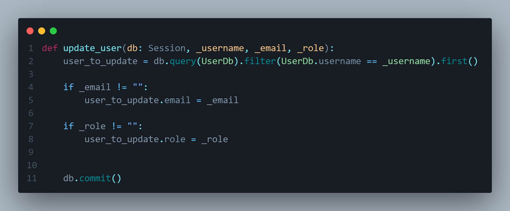

# fast-api-v2
sample project building an api using FastAPI and python

## commands used for setup 
- Setup 

    - py -3 -m venv venv 

    - . venv/Scripts/activate 

    - pip install fastapi 

    - pip install uvicorn 

    - pip freeze > requirements.txt

- Pytest

    - pip install pytest

    - pip install httpx

- Sqlalchemy

    pip install sqlalchemy

## 01. Initial commit 
is to have the venv installed and updated readme

## 02. Added requirements.txt
adding a file called requirements.txt for dependency management

## 03. Created main.py file
created main.py file to run endpoint and test to make sure our code runs

## 04. Swagger spec documentation
swagger ui is included in FastAPI meaning we don't have to write it out from scratch like Flask

## 05. Created app_test.py in tests folder 
testing welcome path op

## 06. Created health enpoint and created a test for this endpoint

## 07. Installed sqlalchemy dependency and created a db_config file for database connection

## 08. Creating users data table 
id column is generated after the other 2 fields are entered
primary key makes it easier for us to find the user
string(#) will alow how many characters are entered
unique ensuring there is one 1 particular value in the database
nullable meaning this field is required 

## 09. Created schema.py
this is for when someone is entering data, the data will be bumped against the schema to make sure all fields are present before interacting with the database

orm stands for object realational mapping

## 10. Created user_repository.py file
this file will have the functions we need to interact with the database
this will also have a test data function for testing

## 11. Created a create_db function
this function is for creating our db file in db/local_sqlite

this will drop_all data at first then create the data and add the test data

## 12. Moved welcome and health endpoint to app_router.py located in the router folder

## 13. Created get_all_users function in user_repository.py
this code allows us to retrieve all the users in the database
also added a function in the users_router.py for users to access

## 14. Created get_all_users test in users_test.py
this test is will be testing the first data in our test.db making sure all the values are present

## 15. Created get_by_username function in user_repository.py and get_by_username path operation in users_router
these codes will allow us to get information from a single user by their username 

## 16. Created get_by_username test in users_test.py file testing the 200 and 404 response codes and return messages

## 17. Created add_user function in users_router.py file and created a CreateUserModel in schemas.py prompting the user to enter in the required fields before creating user to the database

## 18. Created add_user function to users_test.py file
this test will test our post operation in users_router.py and will also preform a get call to check the user information that is created in test.db file

## 19. Created different scenario tests for add_user function in users_router.py
testing different fields to make sure a status_code of 400 is responded to user when not entering all fields for post request

## 20. Added update_user function to users_repository.py
this code will udpate the fields if values are given by the user. We do not want the user to be able to update the username but email and role fields can be updated 

## 21. Created update_user function in users_router.py file
this function check if there is a value in the email and role fields, then check to for the username within our database, will check there are values entered by the user in both email and role otherwise the fields will not be updated, also checks if both fields are empty

If email or role values are added or both, this will give a 204 status_code and will commit these changes in our database

## 22. Added put user test in users_test.py
testing different areas for put request such as updating both fields or email and role and testing if put request works if we only have 1 field being changed

added more put test by testing the bad scenarios if they body is empty, username not found, and if there is no body in the request

## 23. Added delete user function in users_repository.py and users_router.py 
our functino in users_router.py will also include an if statement to check for the user in our database. If user is not found then we will raise a HTTPException of 404

Also added response headers in all of our user functions in users_router.py

## 24. Added additional function to check if username already exists in our post request function
is the post request function in users_router.py, we added an additonal check to take the username_request variable from the user and checked to see if it exists in our database already. If so, this will raise an HTTPException of 409 - conflict

## 25. Added get_by_email function in users_repository.py and added checking for existing email field in the post request function in users_router.py file
like earlier we were checking if the username already exists in the database, we are checking if the email already exists as well and if it does, we raise a 409 Conflict

## 26. Added 2 delete test function to users_test.py
the first function will create a test user then delete them and will also 'get' user as well to check if user is truly deleted

the second delete function will check if the user does not exist when trying to delete by username

